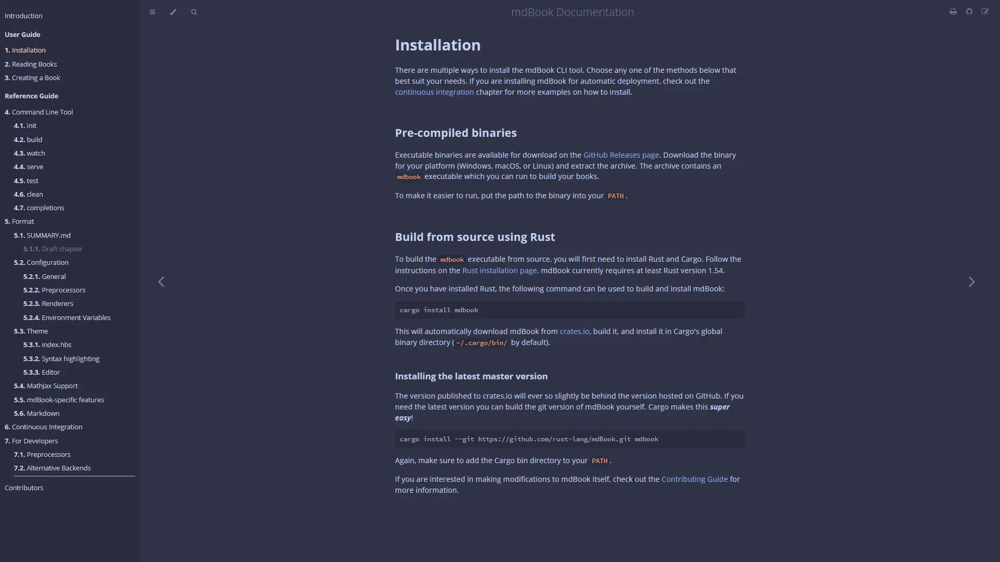

<h3 align="center">
	<br/>
	
	Catppuccin for <a href="https://rust-lang.github.io/mdBook/">mdBook</a>
	
</h3>

<p align="center">
	<a href="https://github.com/catppuccin/mdBook/stargazers"></a>
	<a href="https://github.com/catppuccin/mdBook/issues"></a>
	<a href="https://github.com/catppuccin/mdBook/contributors"></a>
	<a href="https://crates.io/crates/mdbook-catppuccin"></a>
</p>

<p align="center">
	
</p>

## Previews

<details>
<summary>🌻 Latte</summary>

</details>
<details>
<summary>🪴 Frappé</summary>

</details>
<details>
<summary>🌺 Macchiato</summary>

</details>
<details>
<summary>🌿 Mocha</summary>

</details>

## Usage

> [!IMPORTANT]  
> The `mdbook-catppuccin` rust package has been deprecated. For further information
> on why this decision was made, please refer to
> [catppuccin/mdBook#107](https://github.com/catppuccin/mdBook/issues/107)
>
> Please follow the instructions below to install the Catppuccin theme for mdBook.

1. Initialise your mdBook with the theme files:

   ```shell
   mdbook init --theme <name>
   ```

2. Enter the book directory and remove all theme files except `index.hbs`:

   ```shell
   cd <name>
   # Remove all files except index.hbs
   find ./theme -type f ! -name 'index.hbs' -delete
   # Remove the left over empty directories
   rm -d fonts css
   ```

3. Download the [catppuccin.css](https://github.com/catppuccin/mdBook/releases/latest/download/catppuccin.css)
   file from the [latest GitHub release](https://github.com/catppuccin/mdBook/releases/latest) to the `theme`
   directory.

   ```shell
   curl -Lo ./theme/catppuccin.css https://github.com/catppuccin/mdBook/releases/latest/download/catppuccin.css
   ```

   See the [Supported Plugins](#supported-plugins) section below for integrations with other
   mdBook plugins.

4. Update `additional-css` key within the `book.toml` as shown below

   ```diff
   [output.html]
   -additional-css = []
   +additional-css = ["./theme/catppuccin.css"]
   ```

5. Edit the `index.hbs` file to include the Catppuccin flavors:

   ```diff
   - <li role="none"><button role="menuitem" class="theme" id="light">Light</button></li>
   - <li role="none"><button role="menuitem" class="theme" id="rust">Rust</button></li>
   - <li role="none"><button role="menuitem" class="theme" id="coal">Coal</button></li>
   - <li role="none"><button role="menuitem" class="theme" id="navy">Navy</button></li>
   - <li role="none"><button role="menuitem" class="theme" id="ayu">Ayu</button></li>
   + <li role="none"><button role="menuitem" class="theme" id="latte">Latte</button></li>
   + <li role="none"><button role="menuitem" class="theme" id="frappe">Frappé</button></li>
   + <li role="none"><button role="menuitem" class="theme" id="macchiato">Macchiato</button></li>
   + <li role="none"><button role="menuitem" class="theme" id="mocha">Mocha</button></li>
   ```

   Additionally, you can use
   [default-theme](https://rust-lang.github.io/mdBook/format/configuration/renderers.html?highlight=default-theme#html-renderer-options)
   and
   [preferred-dark-theme](https://rust-lang.github.io/mdBook/format/configuration/renderers.html?highlight=preferred-dark-theme#html-renderer-options)
   keys for setting default light/dark mode themes in your `book.toml`.

   E.g. To set the default theme to `latte` and default dark mode to `mocha`:

   ```diff
   [output.html]
   + default-theme = "latte"
   + preferred-dark-theme = "mocha"
   ```

6. Build using `mdbook build` and enjoy your new Catppuccin flavors!

### Supported Plugins

This theme also generates CSS files to style elements added by other mdBook
plugins. We support the following list of plugins:

| Plugin                                                            | CSS File                                                                                                         |
| ----------------------------------------------------------------- | ---------------------------------------------------------------------------------------------------------------- |
| [mdbook-admonish](https://github.com/tommilligan/mdbook-admonish) | [catppuccin-admonish.css](https://github.com/catppuccin/mdBook/releases/latest/download/catppuccin-admonish.css) |
| [mdbook-alerts](https://github.com/lambdalisue/rs-mdbook-alerts)  | [catppuccin-alerts.css](https://github.com/catppuccin/mdBook/releases/latest/download/catppuccin-alerts.css)     |

The CSS file(s) can be downloaded and added to the `additional-css` key shown
in step `4.` of the [Usage](#usage) section.

## Development

1. Clone the repository and navigate to the repository root.

   ```shell
   git clone https://github.com/catppuccin/mdbook
   cd mdbook
   ```

2. Generate the CSS files:

   ```shell
   pnpm install
   pnpm run build
   ```

## Acknowledgement

[mdbook-admonish](https://github.com/tommilligan/mdbook-admonish) for
inspiration on the `install` command for the now deprecated `mdbook-catppuccin`
binary.

## 💝 Thanks to

- [Hamothy](https://github.com/sgoudham)
- [winston](https://github.com/nekowinston)

&#160;

<p align="center">
	
</p>

<p align="center">
	Copyright &copy; 2021-present <a href="https://github.com/catppuccin" target="_blank">Catppuccin Org</a>
</p>

<p align="center">
	<a href="https://github.com/catppuccin/catppuccin/blob/main/LICENSE"></a>
</p>
